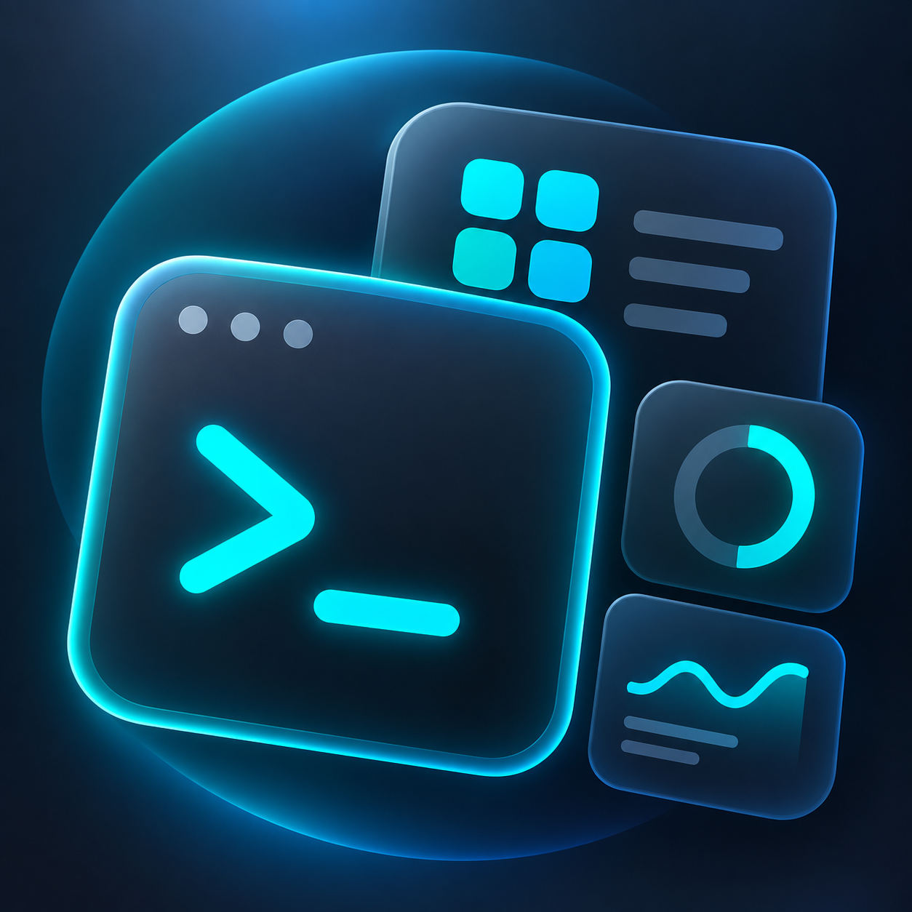

# DeskKit

用 JavaScript 脚本和 JSON 配置，制作原生 macOS 桌面小组件与菜单栏工具。

这是 Andreas 的个人实验项目，一个有点 tricky 的小工具。**没有正式版，不保证稳定性、兼容性或长期维护。**

## 核心功能

- 一份组件同时提供菜单栏和桌面卡片；桌面外观与显示行为由 WidgetKit 管理。
- 菜单栏适合网速等高频数据；桌面小组件的刷新由 macOS 调度，不保证实时。
- 在应用内编辑脚本与配置，预览草稿，确认保存后才影响正在使用的组件。

## 三个参考样例

[下载样例包](Examples/DeskKit-examples.zip) · [查看样例源码](Plugins) · [组件编写说明](PluginGuide.md)

| 样例 | 用途 | 依赖 |
| --- | --- | --- |
| 系统状态 | 网速、CPU、内存和磁盘 | 本机网络接口与系统统计 |
| Codex 额度 | 剩余额度与重置时间 | 本机安装并登录 Codex，且客户端支持对应额度查询 |
| 国内金价 | 价格、涨跌与报价时间 | 第三方网站可访问，且数据格式未变化 |

**三个样例仅供参考，不保证安装到下载者电脑后立刻正常使用。** 它们默认停用，不附带作者的登录信息、缓存或本机路径。应用首次启动会放入这三个样例；也可以解压下载包，使用左下角的导入按钮选择一个 `.deskkit` 文件夹。已有相同 ID 时无需重复导入。

要构建符合自己需求的组件，需要自己编写或调整 `render.js` 和 `widget.json`。可以把样例和[编写说明](PluginGuide.md)交给大模型，让它按你的需求模仿构建；生成后仍需自己检查数据源、命令和输出。

## 使用与构建

工程目标为 macOS 14+；未覆盖所有系统版本和机型。实验 DMG 不是正式发行版，使用开发签名、**没有 Apple 公证**，可能无法在其他电脑直接打开，桌面扩展也依赖正确签名。安装包与源码不包含 Codex 客户端。

从源码构建请看[构建说明](BUILDING.md)。项目仅使用系统框架；个人开发者也需要配置自己的 Apple 签名身份和 App Group 才能使用桌面扩展。

只启用可信组件，尤其是 `command` 数据源：它能以当前用户权限运行本地程序。金价示例依赖第三方接口，不承诺接口授权、可用性或行情准确性。更多信息见[隐私与权限说明](PRIVACY.md)。

## 作者与许可

由 [Andreas](https://github.com/Andreaslinshy) 发起、设计并维护，使用 Codex 辅助开发。代码、示例和随附图标采用 [MIT License](LICENSE)。欢迎反馈或贡献。
